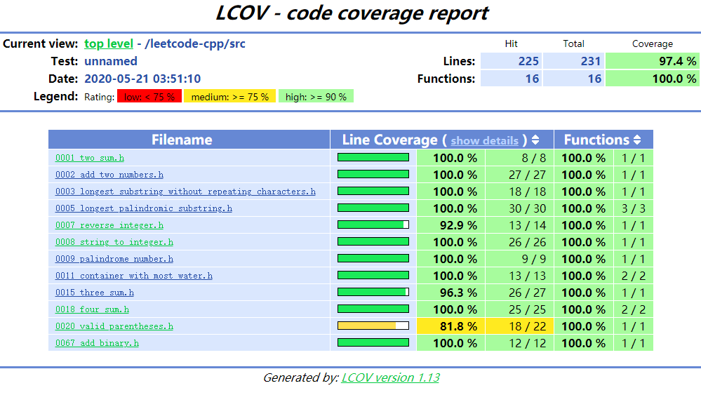

# LeetCode Cpp

[![Travis Build Status][travis-image]][travis-url]


## Check format and test

```bash
cd top_dir_of_the_project
sh tools/presubmit.sh
```


## Coverage

Bazel 目前不能支持对高版本 GCC 9 的覆盖率测试和转换，目前[bazelbuild/bazel#9406](https://github.com/bazelbuild/bazel/issues/9406)该Issue还处于Open状态。

这里提供了一个 GCC 7 的编译环境，用于测试覆盖率。

具体说明见Docker工具中的 [README](tools/docker/README.md)

生成的覆盖率报告将存放在`bazel-coverage`目录下，格式为HTML，形式如下：




[travis-image]: https://travis-ci.org/panzhongxian/leetcode-cpp.svg?branch=master
[travis-url]: https://travis-ci.org/panzhongxian/leetcode-cpp


